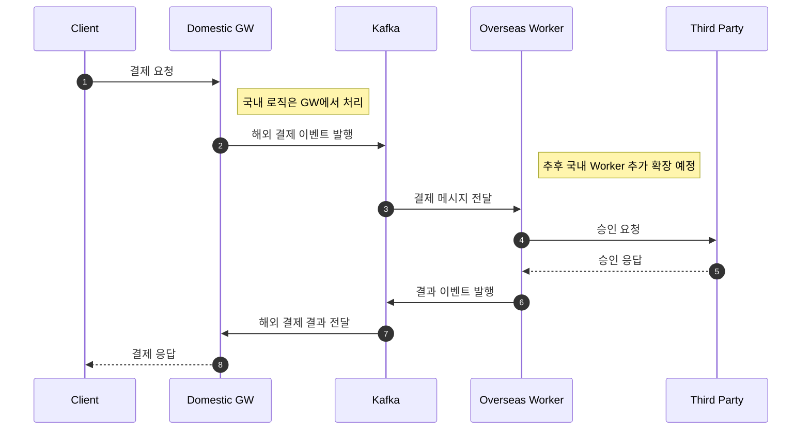
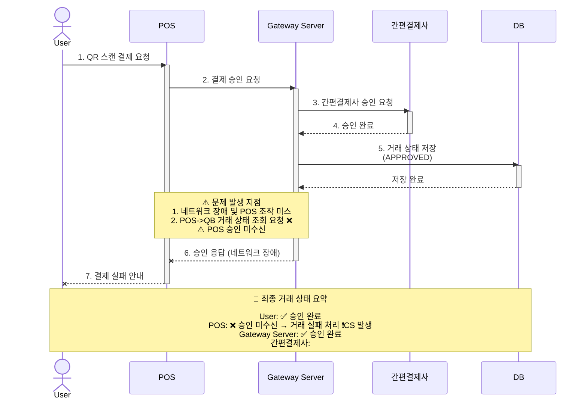
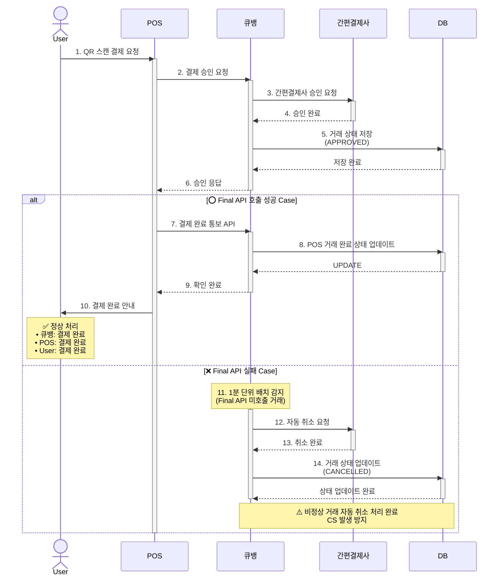

# 본인의 이력서를 마크다운화 해서 작성합니다.

> 추가적으로 자세한 내용은 아래 링크를 참조하세요 <br>
> [1.이력서](resume/resume.html) <br>
> [2.경력기술서](resume/career.html)

# Resume

---

## Summary / About Me
- QR 결제 중계 시스템(통합 결제/가맹점 접수/거래 상태 조회) 백엔드 개발 및 운영 경험
- Spring Boot/Java 기반 상용 서비스 운영, Kafka 기반 이벤트 아키텍처 설계/구현
- 성능 개선(응답시간 60% 개선), 장애 대응(파일 유실률 0%), CS 감소(월 10건→1건) 등 지표 기반 개선 경험

## Skills
- Backend: Java, Spring Boot, Spring Data JPA, QueryDSL
- Data/Storage: MySQL, Redis
- Messaging: Kafka (Spring Kafka)
- Others: Git

---

## Work Experience
### BE Server Developer
- Period: 2024.01 ~ (재직/진행)
- Tech Stack: Spring Boot, Java, MySQL, Kafka, Redis, QueryDSL

---

## Projects

### 1) QR 결제 중계 시스템 프로젝트 (2024.06 ~ 진행)
#### 1. 국내/국외 통합 결제 서비스 아키텍처 설계 및 개발
**배경**
- QR 결제 통합 결제 서비스의 국내/국외 확장을 위한 아키텍처 개선 프로젝트

**문제**
- Gateway 서버가 Third Party 서버를 직접 호출하는 강결합 아키텍처로 인해 서비스 확장성 제한
- 동기 블로킹: Gateway가 Third Party 응답을 계속 대기, Third Party 장애 시 Gateway도 블로킹

**트러블슈팅 / 해결**
- Kafka Request-Reply 분산 환경 메시지 처리 이슈
    - 인스턴스별 고유 Reply 토픽 생성으로 해결
- Kafka 기반 이벤트 기반 아키텍처 설계로 확장성 확보 (비즈니스 확장 준비)
- Kafka Request-Reply 패턴 구현으로 동기 처리 보장
- DLQ 설계로 실패 메시지 추적/재처리 체계 구축 → 결제 실패율 80% 감소

### AS-IS ~ TO-BE


### TO-BE


#### 2. 가맹 모집 서비스 최적화
**배경**
- 가맹점 접수 프로세스에서 파일 유실 문제로 CS 발생

**문제**
- SFTP 접속 세션 제한(서버 최대 10개)으로 동시 접수 증가 시 업로드 실패
- 사용자는 성공 응답을 받았으나 백엔드 업로드 실패 시 파일 유실(사용자 인지 불가)
- 재접수 안내 부재 → CS를 통해서만 인지

### AS-IS ~ TO-BE


**해결**
- 로컬 서버 임시 저장소 활용
    - 비동기 이벤트 요청 시 로컬 임시 디렉토리에 저장
    - 이벤트 정상 처리 완료 시 임시 파일 삭제
- SFTP 연결 실패 시 재시도 로직(최대 5회, 지수 백오프) 추가
- 트랜잭셔널 아웃박스(Transactional Outbox) 패턴 도입
    - 30분 단위 배치로 DB 상태 확인 후 PENDING/FAIL 건만 재처리
- 트랜잭션 경계 최적화
    - Early Return 패턴 적용으로 불필요 쿼리 제거

**성과**
- API 응답시간 60% 개선 (300ms → 120ms)
- 불필요 DB 커넥션 횟수 최대 90% 감소, 트랜잭션 점유 시간 30% 감소
- 장애 시 파일 유실률 100% → 0%
- 월 CS 문의 건수 3건 → 0건

```mermaid
```

#### 3. 거래 상태 조회 API 개선
**배경**
- 거래 상태 확인 Polling API 최적화로 POS 응답 시간 개선 및 불필요 DB 커넥션 개선

**문제**
- 상태 확인 Polling 지연 시, 1회 호출로 최대 120회 조회 (1초 단위) → 지나친 DB 커넥션 낭비
- API 1회 호출 시 단일 트랜잭션 실행으로 커넥션 점유(최대 300ms)

### AS-IS ~ TO-BE


**해결**
- Redis 캐시 레이어 도입
    - Cache-Aside 패턴으로 동일 거래 상태 중복 조회 제거
    - Cache Hit 시 DB 접근 최소화
- 트랜잭션 경계 최적화
    - 단일 트랜잭션 분리 + Early Return으로 불필요 후속 쿼리 제거

**성과**
- API 응답시간 60% 개선 (300ms → 120ms)
- 불필요 DB 커넥션 횟수 최대 90% 감소
- 트랜잭션 점유 시간 30% 감소

```mermaid
```

#### 4. 결제 프로세스 개선을 통한 CS 발생률 감소
**배경**
- POS ↔ 큐뱅 ↔ User 간 거래 상태 불일치로 인한 비정상 거래 관련 CS 월 평균 10건 발생

**문제**
- 결제 완료 최종 상태 동기화 부재 (POS↔큐뱅 간 최종 상태 확인 프로세스 없음)
- 네트워크 지연/장애 및 사용자 조작으로 상태 불일치 발생
- 비정상 거래 판별 기준 미흡으로 사후 CS 처리 증가

### AS-IS


### TO-BE


**해결**
- 시장 조사 및 솔루션 선정
    - SSE, Webhook, Final API 방식 등 결제 안정성 모범사례 조사
    - 인프라/비용 대비 효율 분석 후 Final API 방식 선정 및 사내 공유
- Final API 패턴 도입
    - 결제 완료 처리 이전 POS → 큐뱅 ‘결제 완료 통보 API’ 추가
    - API 미호출 시 비정상 거래로 자동 판단 및 취소 처리
    - 트랜잭션 무결성 보장을 위한 검증 로직 구현

**성과**
- 거래 상태 불일치율 95% 감소
- 월 CS 발생 건수 10건 → 1건

```mermaid
```

#### 5. 기술 문서화 시스템 구축 및 온보딩 프로세스 표준화
**배경**
- 스타트업 환경에서 기술 문서 부재로 반복 질문 증가 및 신규 개발자 온보딩 시간 과다

**문제**
- 구두 전달 방식으로 지식 휘발 및 커뮤니케이션 비용 증가
- 시스템 아키텍처/비즈니스 로직 문서화 부재
- 신규 개발자 온보딩 시 기존 개발자 업무 중단(하루 평균 3시간)
- API 스펙 비일관성으로 외부 연동 커뮤니케이션 오류

**해결**
- JetBrains YouTrack 도입을 통한 티켓 기반 기술 스펙 작성 체계 구축 (Why/Story 중심)
- 온보딩 프로세스 표준화
    - 로컬 개발 환경 쉘 스크립트로 “10초 실행” 수준으로 단순화
    - redis/mysql/kafka/vault 등 통합 구성으로 세팅 비용 감소
- 코드 리뷰 문화 정착
    - PR 템플릿(변경 이유/테스트 방법/체크리스트)
    - PCI DSS 보안 체크리스트 통합

**성과**
- YouTrack 기반 문서/히스토리/온보딩 문서화로 신규 개발자 온보딩 비용 50% 절감

```mermaid
```

---

## Activities
- 웹 개발 기초/심화 학습 및 팀 프로젝트 2회 수행 (협업 경험)

## Projects (Etc.)
- (2023.06 ~ 12) seoul-fit: 서울시 공공데이터 API 10개 이상 연동, 데이터 ETL, 코드 오픈소스화를 위한 추상화
- (2025.07 ~ 08) POS 연동 QR 결제 (프로젝트명/기간 기재)

## Open Source
- es-hangul-java
    - 토스 한글 처리 라이브러리(es-hangul)를 Java/SpringBoot로 포팅
    - Maven Central 배포 및 사내 가맹점 접수 시스템 적용

---

## Education
- 2018.03 ~ 2025.02 (학교/전공은 PDF에 표기된 텍스트가 깨져 있어 별도 기재 필요)
- 주요 학습/기술: Java, Spring Boot, Spring Data JPA, Spring Kafka, MySQL, Redis
