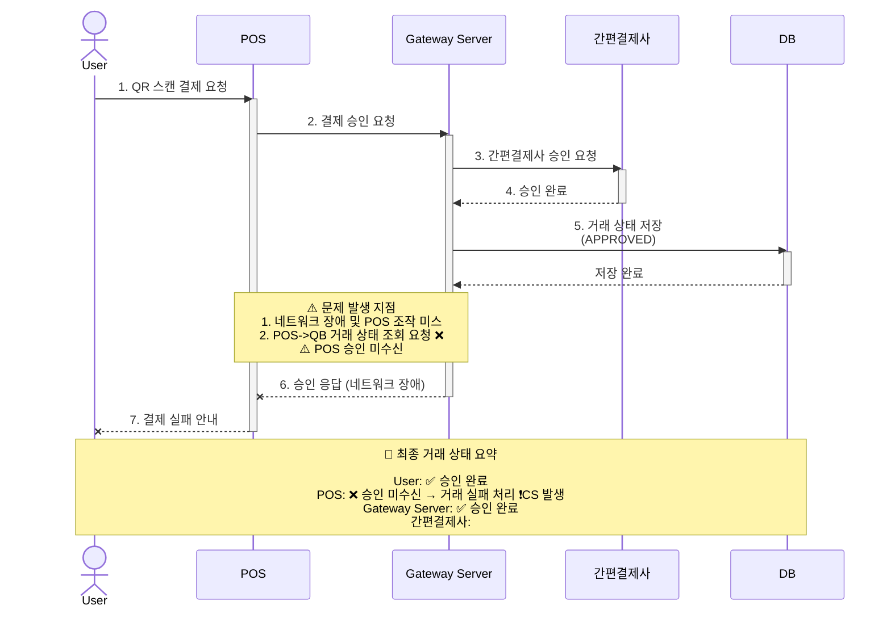
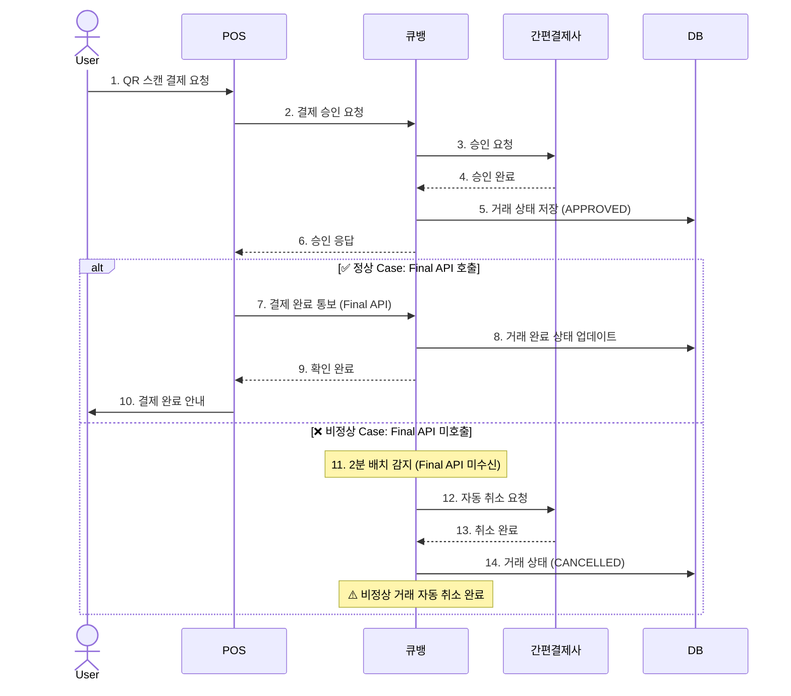

## QB Gateway-AS-IS

```mermaid
---
config:
  theme: mc
  sequence:
    diagramMarginY: 20
    boxMargin: 10
    noteMargin: 10
    messageMargin: 50
---
sequenceDiagram
    actor User
    participant POS
    participant QB as Gateway Server
    participant Pay as 간편결제사
    participant DB

    
    User->>POS: 1. QR 스캔 결제 요청
    activate POS
    POS->>QB: 2. 결제 승인 요청
    activate QB
    QB->>Pay: 3. 간편결제사 승인 요청
    activate Pay
    Pay-->>QB: 4. 승인 완료
    deactivate Pay
    QB->>DB: 5. 거래 상태 저장<br/>(APPROVED)
    activate DB
    DB-->>QB: 저장 완료
    deactivate DB
    Note over POS,QB: ⚠️ 문제 발생 지점<br/>1. 네트워크 장애 및 POS 조작 미스<br/>2. POS->QB 거래 상태 조회 요청 ❌<br/>⚠️ POS 승인 미수신
    QB--xPOS: 6. 승인 응답 (네트워크 장애)
    deactivate QB
    POS--xUser: 7. 결제 실패 안내
    deactivate POS
    Note over User,DB: 🧾 최종 거래 상태 요약<br/><br/>User: ✅ 승인 완료 <br/>POS: ❌ 승인 미수신 → 거래 실패 처리 ❗️CS 발생 <br/>Gateway Server: ✅ 승인 완료 <br/>간편결제사:
```

## TO-BE flow

```mermaid
---
config:
  theme: mc
  sequence:
    diagramMarginY: 20
    boxMargin: 10
    noteMargin: 10
    messageMargin: 50
---
sequenceDiagram
    actor User
    participant POS
    participant QB as 큐뱅
    participant Pay as 간편결제사
    participant DB

    User->>POS: 1. QR 스캔 결제 요청
    POS->>QB: 2. 결제 승인 요청
    QB->>Pay: 3. 승인 요청
    Pay-->>QB: 4. 승인 완료
    QB->>DB: 5. 거래 상태 저장 (APPROVED)
    QB-->>POS: 6. 승인 응답

    alt ✅ 정상 Case: Final API 호출
        POS->>QB: 7. 결제 완료 통보 (Final API)
        QB->>DB: 8. 거래 완료 상태 업데이트
        QB-->>POS: 9. 확인 완료
        POS->>User: 10. 결제 완료 안내

    else ❌ 비정상 Case: Final API 미호출
        Note over QB: 11. 2분 배치 감지 (Final API 미수신)
        QB->>Pay: 12. 자동 취소 요청
        Pay-->>QB: 13. 취소 완료
        QB->>DB: 14. 거래 상태 (CANCELLED)
        Note over QB: ⚠️ 비정상 거래 자동 취소 완료
    end
```
