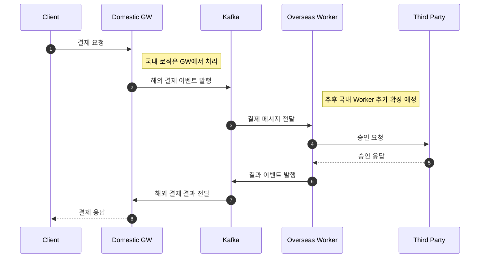

## Kafka Flow

### AS-IS

### TO-BE

```mermaid
---
config:
  theme: mc
---
sequenceDiagram
    autonumber

    participant C as Client
    participant DGW as Domestic GW
    participant K as Kafka
    participant OW as Overseas Worker
    participant TP as Third Party

    C->>DGW: 결제 요청

    note right of DGW: 국내 로직은 GW에서 처리

    DGW->>K: 해외 결제 이벤트 발행
    note right of OW: 추후 국내 Worker 추가 확장 예정
    K->>OW: 결제 메시지 전달
    OW->>TP: 승인 요청
    TP-->>OW: 승인 응답
    OW->>K: 결과 이벤트 발행


    K->>DGW: 해외 결제 결과 전달
    DGW-->>C: 결제 응답

```