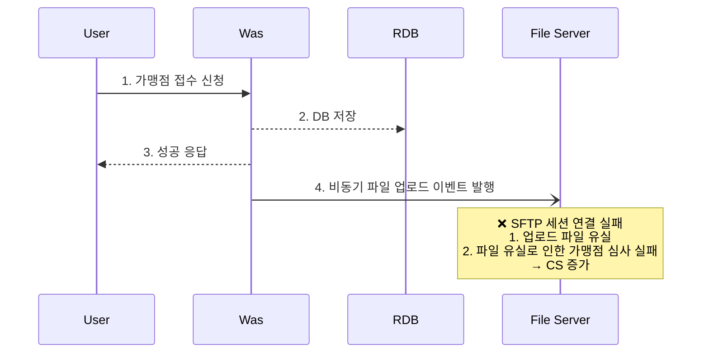
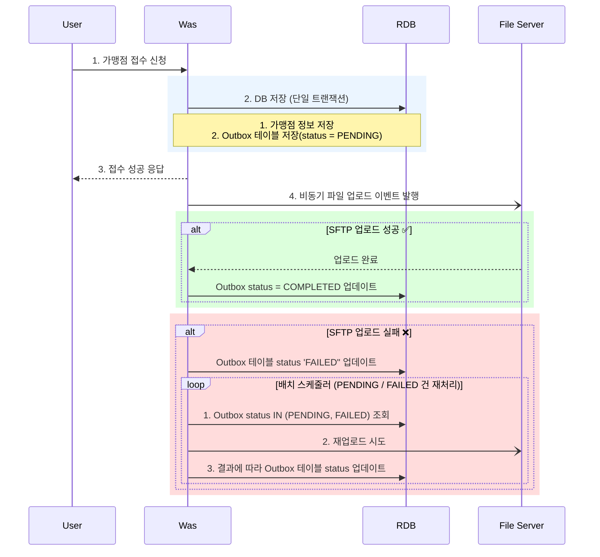
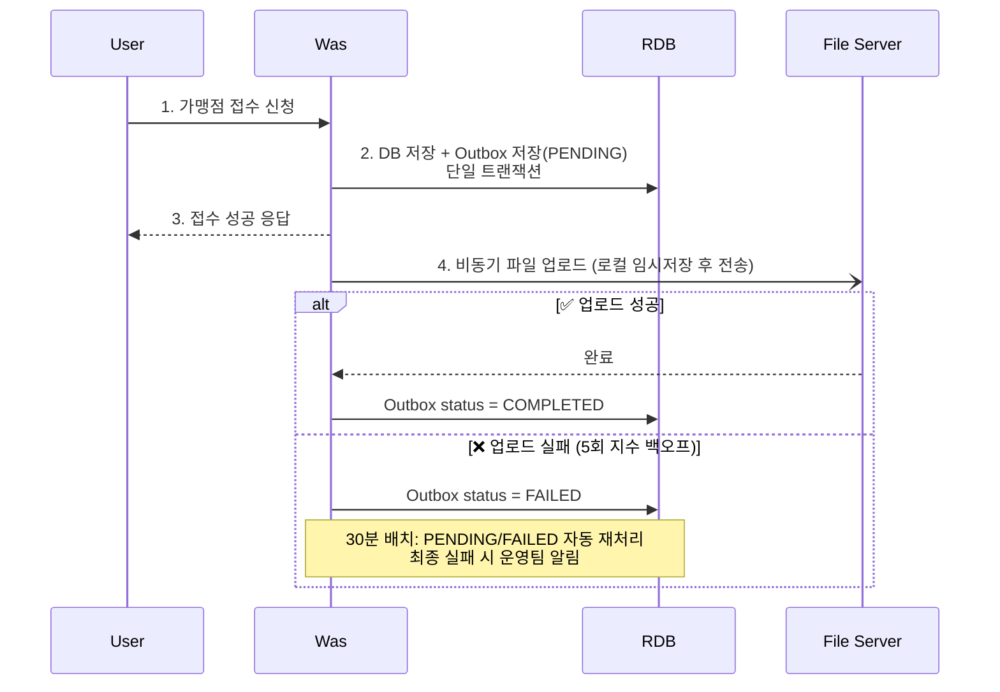

## QB Merchant Flow

### AS-IS

```mermaid
---
config:
  theme: mc
---
sequenceDiagram
    participant U as User
    participant W as Was
    participant R as RDB
    participant F as File Server

    U->>W: 1. 가맹점 접수 신청
    W-->>R: 2. DB 저장
    W-->>U: 3. 성공 응답

    W-)F: 4. 비동기 파일 업로드 이벤트 발행
    Note over F: ❌ SFTP 세션 연결 실패<br/>1. 업로드 파일 유실<br/>2. 파일 유실로 인한 가맹점 심사 실패<br/>→ CS 증가
```

### TO-BE

```mermaid
---
config:
  theme: mc
---
sequenceDiagram
    participant U as User
    participant W as Was
    participant R as RDB
    participant F as File Server

    U->>W: 1. 가맹점 접수 신청

    rect rgb(235, 245, 255)
        W->>R: 2. DB 저장 (단일 트랜잭션)
        Note over W,R: 1. 가맹점 정보 저장<br/>2. Outbox 테이블 저장(status = PENDING)
    end

    W-->>U: 3. 접수 성공 응답

    W-)F: 4. 비동기 파일 업로드 이벤트 발행

    rect rgb(220, 255, 220)
        alt SFTP 업로드 성공 ✅
            F-->>W: 업로드 완료
            W->>R: Outbox status = COMPLETED 업데이트
        end
    end

    rect rgb(255, 220, 220)
        alt SFTP 업로드 실패 ❌
            W->> R: Outbox 테이블 status 'FAILED" 업데이트
            loop 배치 스케줄러 (PENDING / FAILED 건 재처리)
                W->>R: 1. Outbox status IN (PENDING, FAILED) 조회
                W-)F: 2. 재업로드 시도
                W->>R: 3. 결과에 따라 Outbox 테이블 status 업데이트
            end
        end
    end
```

```mermaid
---
config:
  theme: mc
---
sequenceDiagram
    participant U as User
    participant W as Was
    participant R as RDB
    participant F as File Server

    U->>W: 1. 가맹점 접수 신청
    W->>R: 2. DB 저장 + Outbox 저장(PENDING)<br/>단일 트랜잭션
    W-->>U: 3. 접수 성공 응답
    W-)F: 4. 비동기 파일 업로드 (로컬 임시저장 후 전송)

    alt ✅ 업로드 성공
        F-->>W: 완료
        W->>R: Outbox status = COMPLETED
    else ❌ 업로드 실패 (5회 지수 백오프)
        W->>R: Outbox status = FAILED
        Note over W,R: 30분 배치: PENDING/FAILED 자동 재처리<br/>최종 실패 시 운영팀 알림
    end
```