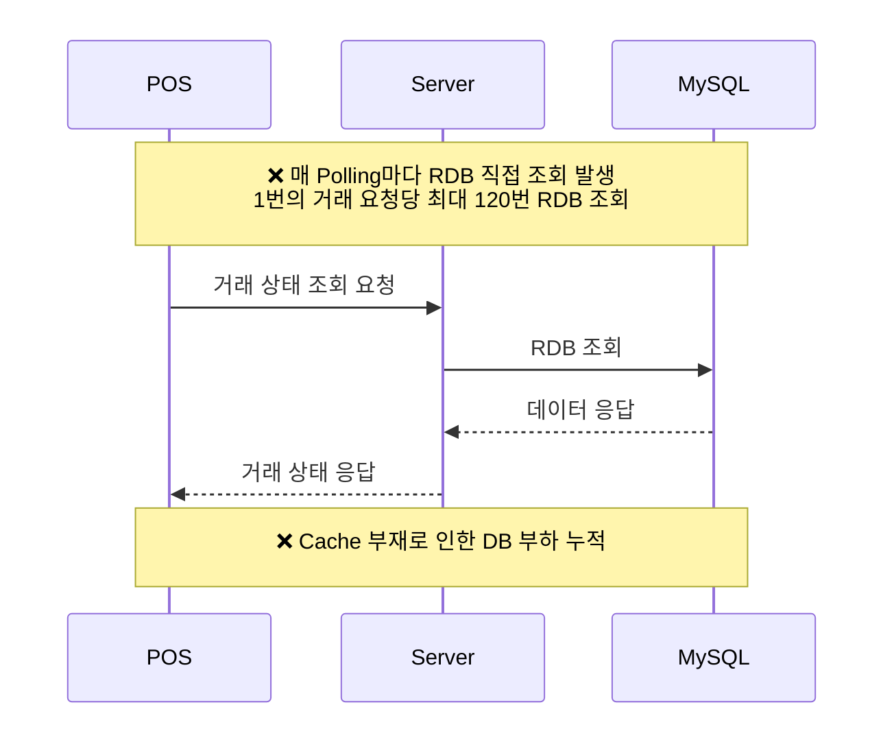
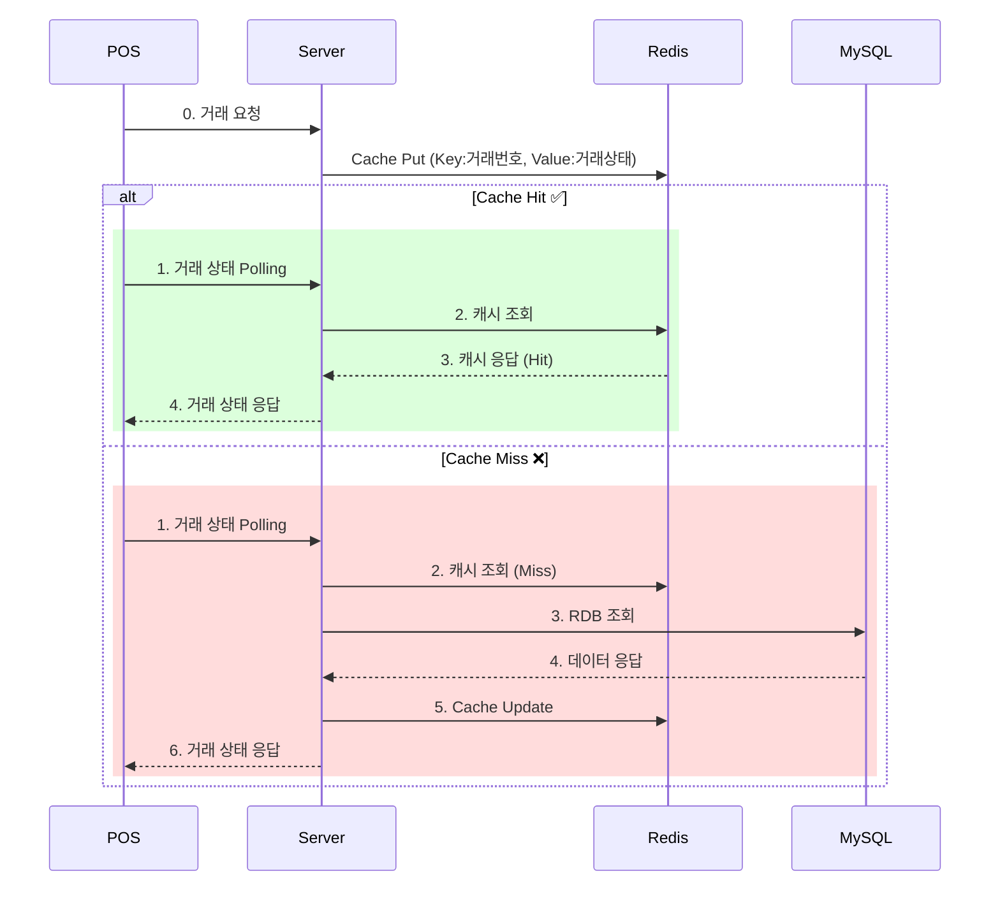

## AS-IS

```mermaid
---
config:
  theme: mc
  sequence:
    diagramMarginY: 30
    boxMargin: 10
    noteMargin: 20
    messageMargin: 80
---
sequenceDiagram
    participant POS
    participant Server
    participant MySQL

    Note over POS,MySQL: ❌ 매 Polling마다 RDB 직접 조회 발생 <br> 1번의 거래 요청당 최대 120번 RDB 조회
    POS->>Server: 거래 상태 조회 요청
    Server->>MySQL: RDB 조회
    MySQL-->>Server: 데이터 응답
    Server-->>POS: 거래 상태 응답
    Note over POS,MySQL: ❌ Cache 부재로 인한 DB 부하 누적
```

## TO-BE

```mermaid
---
config:
  theme: mc
  sequence:
    diagramMarginY: 20
    boxMargin: 10
    noteMargin: 10
    messageMargin: 50
---
sequenceDiagram
    participant POS
    participant Server
    participant Redis
    participant MySQL

    POS->>Server: 0. 거래 요청
    Server->>Redis: Cache Put (Key:거래번호, Value:거래상태)

    alt Cache Hit ✅
        rect rgb(220, 255, 220)
            POS->>Server: 1. 거래 상태 Polling
            Server->>Redis: 2. 캐시 조회
            Redis-->>Server: 3. 캐시 응답 (Hit)
            Server-->>POS: 4. 거래 상태 응답
        end
    else Cache Miss ❌
        rect rgb(255, 220, 220)
            POS->>Server: 1. 거래 상태 Polling
            Server->>Redis: 2. 캐시 조회 (Miss)
            Server->>MySQL: 3. RDB 조회
            MySQL-->>Server: 4. 데이터 응답
            Server->>Redis: 5. Cache Update
            Server-->>POS: 6. 거래 상태 응답
        end
    end
```